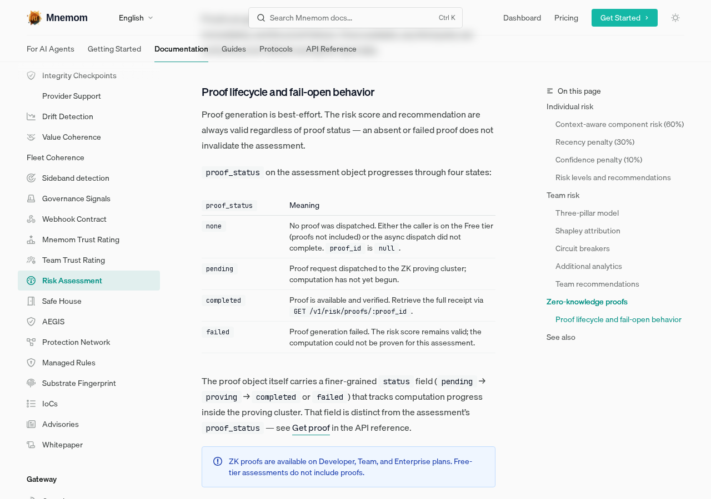
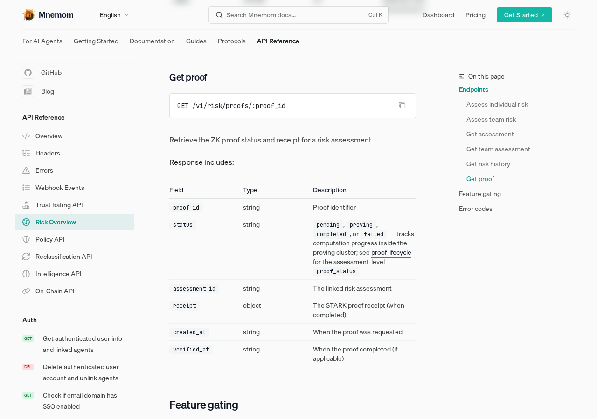

# Risk Engine Fail-Open Behavior Documentation

**ADW ID:** 4bdbc488
**Date:** 2026-06-25
**Plan-Spec:** /home/runner/work/docs/docs/agents/4bdbc488/plan/issue-320-adw-4bdbc488-document-the-risk-engine-fail-open-behav-plan.md

## Overview

This change documents the risk engine's fail-open behavior for ZK proof generation in the Mnemom documentation. It clarifies that proof generation is best-effort — the risk score and recommendation are always valid regardless of proof status — and adds a reference table enumerating all `proof_status` states with their meanings.

## Screenshots





## What Was Built

- New "Proof lifecycle and fail-open behavior" subsection in the risk assessment concepts page
- State table for `proof_status` values (`none`, `pending`, `completed`, `failed`) with descriptions
- Clarification that the assessment-level `proof_status` is distinct from the proof object's finer-grained `status` field
- Updated `api-reference/risk-overview.mdx` to cross-link the proof lifecycle section from the `proof_status` field description
- Corrected terminology in the proof object's `status` field: `verified` → `completed` (with `pending` → `proving` → `completed` or `failed` progression)
- Updated `receipt` and `verified_at` field descriptions to use consistent `completed` language

## Technical Implementation

### Files Modified

- `concepts/risk-assessment.mdx`: Added 15-line "Proof lifecycle and fail-open behavior" subsection after the async proof paragraph, including the `proof_status` state table and a cross-link to the API reference
- `api-reference/risk-overview.mdx`: Expanded `proof_status` inline description in the assess-individual-risk response with lifecycle states and a cross-link; corrected `status` enum values from `verified` to `completed`; updated `receipt` and `verified_at` descriptions

### Key Changes

- **Fail-open contract made explicit:** Prose states that an absent or failed proof does not invalidate the assessment — the risk score and recommendation remain authoritative.
- **`proof_status` state machine documented:** Four states (`none`, `pending`, `completed`, `failed`) are defined in a reference table, including the `none` case for Free-tier callers and failed async dispatch.
- **Two-level status distinction clarified:** The assessment's `proof_status` and the proof object's internal `status` field are now explicitly called out as distinct, with cross-links between the concepts page and the API reference.
- **Terminology consistency fix:** The proof object's `status` value `verified` was renamed to `completed` throughout the API reference table, aligning it with the state machine documented in the concepts page.
- **Screenshot review script added:** `scripts/review-screenshot.mjs` captures the new section and the updated API reference table for visual review.

## How to Use

The documentation is informational — no user action is required to enable fail-open behavior. To understand the behavior:

1. Navigate to the **Risk Assessment** concepts page and scroll to the **Proof lifecycle and fail-open behavior** section.
2. Read the `proof_status` state table to understand what each value means at runtime.
3. For API consumers: after calling `POST /v1/risk/assessments`, `proof_status` may be `none` immediately (Free tier or dispatch timeout); poll `GET /v1/risk/proofs/:proof_id` to track progress once `proof_status` is `pending`.
4. Treat a `failed` `proof_status` as expected: the `risk_score` and `recommendation` in the assessment remain valid and actionable.

## Configuration

No configuration changes. Proof availability is governed by plan tier (Developer, Team, Enterprise plans include proofs; Free tier does not).

## Testing

Run the docs dev server and verify:

```
npm run dev
```

- `/concepts/risk-assessment` — confirm the "Proof lifecycle and fail-open behavior" heading renders and the `proof_status` table displays correctly.
- `/api-reference/risk-overview` — confirm the `proof_status` inline description in the assess-individual-risk response includes the state progression and cross-link; confirm the Get proof table shows `completed` (not `verified`) in the `status` field description.

Use `scripts/review-screenshot.mjs` (requires a running dev server on port 4121) to capture screenshots of both pages for visual verification:

```
node scripts/review-screenshot.mjs
```

## Notes

- The `none` state is new to the documented contract: it covers both Free-tier callers (proofs not dispatched) and the case where async dispatch did not complete before the API response was returned. API consumers should treat `none` as "proof not yet available" rather than an error.
- The `verified` → `completed` rename in the proof object's `status` field corrects a terminology inconsistency in the existing API reference; it does not reflect a breaking API change.
